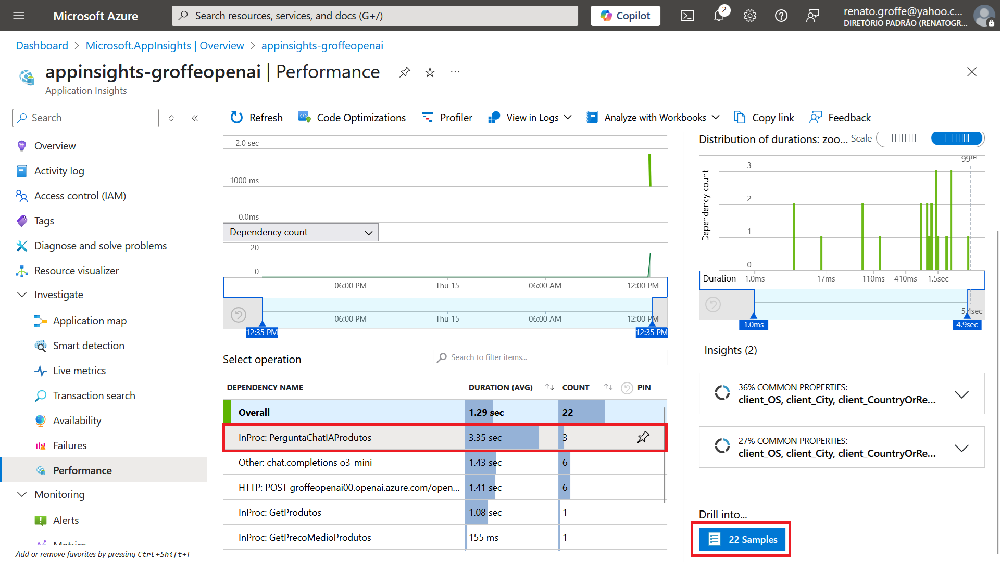

# dotnet9-semantickernel-postgres-otel-azureappinsights_consultaprodutos
Exemplo em .NET 9 de Console Application que faz uso do projeto Semantic Kernel, com integração com soluções de IA como Azure Open AI e Ollama na consulta de informações de produtos em uma base PostgreSQL. Inclui Docker Compose para criação do ambiente de testes com os dados + monitoramento com Application Insights/Azure Monitor.

Referências:
* [Enable Azure Monitor OpenTelemetry for .NET, Node.js, Python, and Java applications](https://learn.microsoft.com/en-us/azure/azure-monitor/app/opentelemetry-enable?tabs=net)

---

## Resultados da Telemetria

Acesse a partir do recurso do Application Insights as opções Investigate > Performance > Dependencies:

Selecionar a operação correspondente ao Trace em Dependencies e acionar a opção Drill into...:

Selecionar um dos traces (PerguntaChatIAProdutos) em All:

Trace gerado, com a consulta à base de dados:

E exibindo o detalhamento do consumo de tokens (em testes com o Azure OpenAI):

